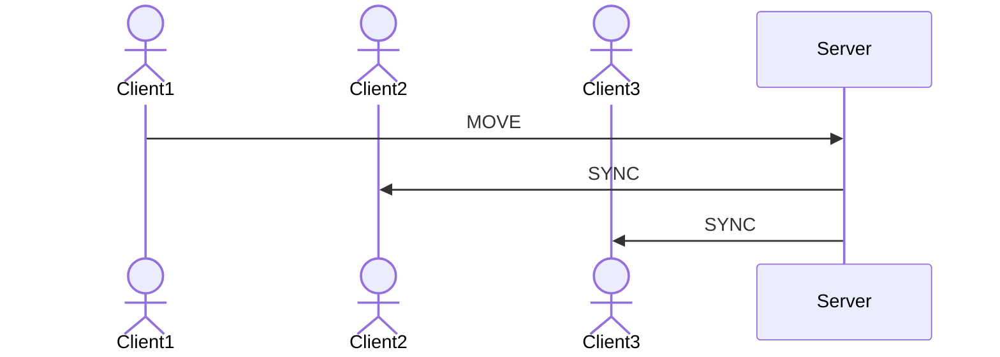

Client-Server Tutorial
======================

The Bonsai.ZeroMQ package allows us to harness the powerful [ZeroMQ](https://zeromq.org/) library to build networked applications in Bonsai. Applications could include:
- Interfacing with remote experimental rigs via network messages
- Performing distributed work across pools of machines (e.g. for computationally expensive deep-learning inference) 
- Streaming video data between clients across a network
- **Real-time interaction between clients in a multiplayer game**

In this article, we will use Bonsai.ZeroMQ to explore this final example and build a basic client-server architecture similar to one that might be used in a multiplayer game.

## Network design
The basic network architecture we want to achieve will be composed of a number of clients sending their state to a server, which then updates the other connected clients with that clients’ state. This is comparable to a multiplayer game in which client players move through the game world and must synchronise that movement via a dedicated server so that all players see each other in their ‘true’ position in the world.

An important requirement to point out here is that our server should be choosy about which clients it broadcasts information to. If client 1 updates the server with its current state, that information needs to be sent to all other connected clients, but there is no need to send it back to client 1 as it already knows its own state and this feedback message would be redundant.

ZeroMQ provides a number of socket types that could be used to achieve something approaching this architecture. The Router / Dealer socket pair acting as Server / Client has a couple of advantages for this design: 
- Routers assign a unique address for each connected client allowing clients in turn to be addressed individually
- Messages can be passed between Router / Dealer sockets without the requirement that a reply is received before the next message is sent, as is the case with the Request / Response socket pair.

## Basic client
To begin with, we’ll create a simple client that sends basic messages on a network. In a new Bonsai project, add a [**`Dealer`**](xref:Bonsai.ZeroMQ.Dealer) node. In the node properties, set Host: localhost, `Port`: 5557, `SocketConnection`: Connect, `SocketProtocol`: TCP.

