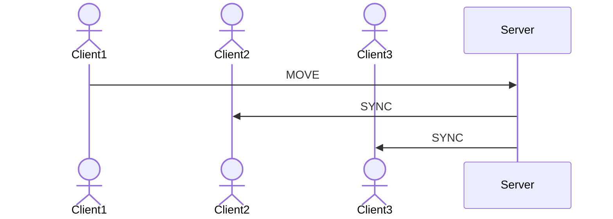

Client-Server Tutorial
======================

The Bonsai.ZeroMQ package allows us to harness the powerful [ZeroMQ](https://zeromq.org/) library to build networked applications in Bonsai. Applications could include:
- Interfacing with remote experimental rigs via network messages
- Performing distributed work across pools of machines (e.g. for computationally expensive deep-learning inference) 
- Streaming video data between clients across a network
- **Real-time interaction between clients in a multiplayer game**

In this article, we will use Bonsai.ZeroMQ to explore this final example and build a basic client-server architecture similar to one that might be used in a multiplayer game.

## Network design
The basic network architecture we want to achieve will be composed of a number of clients sending their state to a server, which then updates the other connected clients with that clients’ state. This is comparable to a multiplayer game in which client players move through the game world and must synchronise that movement via a dedicated server so that all players see each other in their ‘true’ position in the world.

An important requirement to point out here is that our server should be choosy about which clients it broadcasts information to. If client 1 updates the server with its current state, that information needs to be sent to all other connected clients, but there is no need to send it back to client 1 as it already knows its own state and this feedback message would be redundant.

ZeroMQ provides a number of socket types that could be used to achieve something approaching this architecture. The Router / Dealer socket pair acting as Server / Client has a couple of advantages for this design: 
- Routers assign a unique address for each connected client allowing clients in turn to be addressed individually
- Messages can be passed between Router / Dealer sockets without the requirement that a reply is received before the next message is sent, as is the case with the Request / Response socket pair.

## Basic client
To begin with, we’ll create a simple client that sends basic messages on a network. In a new Bonsai project, add a [**`Dealer`**](xref:Bonsai.ZeroMQ.Dealer) node. In the `ConnectionString` property, set `Address`: localhost:5557, `Action`: Connect, `Protocol`: TCP.

In Bonsai.ZeroMQ, the **`Dealer`** can have two functions based on its inputs. On its own, as above, the **`Dealer`** node creates a Dealer socket that listens for messages on the specified network. With the properties specified, we are asking our **`Dealer`** to listen for messages on the local machine on port 5557 using the TCP protocol. We use the ‘Connect’ argument for the `SocketConnection` property to tell the dealer that it will connect to a static part of the network with a known IP address, in this case the server which we will implement later.

If we add inputs to the **`Dealer`**, it will act as both a sender and receiver of messages on the network. Before the **`Dealer`** node add a [**`KeyDown`**](xref:Bonsai.Windows.Input.KeyDown) and [**`String`**](xref:Bonsai.Expressions.String) node in sequence as input to the **`Dealer`**.

:::workflow

:::

In the node properties, set the **`KeyDown`** `Filter` to the ‘1’ key and set the **`String`** `Value` to ‘Client1’. If we run the Bonsai project now, the **`Dealer`** will continue listening for incoming messages on the network, but every time the ‘1’ key is pressed a message containing the string ‘Client1’ will be sent from the socket.

Copy and paste this client structure a couple of times and change the **`KeyDown`** and **`String`** properties accordingly on each (2, ‘Client2’; 3, ‘Client3’) so that we have 3 total clients that send messages according to different key presses.

:::workflow

:::

> For the purposes of this article we are creating all of our clients and our server on the same Bonsai project and same machine for ease of demonstration. In a working example, each client and server could be running in separate Bonsai instances on different machines on a network. In this case, localhost would be replaced with the server machine’s IP address.

## Basic server
Now that we have our client pool set up and sending messages, let’s implement a server to listen for those messages. Add a [**`Router`**](xref:Bonsai.ZeroMQ.Router) node to the project and set its properties to match the **`Dealer`** sockets we already added so that it is running on the same network. As the **`Router`** is acting as server and will be the ‘static’ part of the network, set its `Action` to ‘Bind’.

As with the **`Dealer`** node, a **`Router`** node without any input will simply listen for messages on the network and not send anything in return. If we run the project now and monitor the output of the **`Router`** node, we'll see that each time the client sends a message triggered by its associated key press we get a `ResponseContext` produced at the **`Router`**. Expanding the output the the **`Router`**, we can see it contains a `NetMQMessage`. We [expect](https://netmq.readthedocs.io/en/latest/router-dealer/) this message to be composed of 3 frames: an address (in this case the address of the client that sent the message), an empty delimiter frame and the message content. To make sense of the message, let's expose the `Buffer` `byte[]` of the `First` frame. Add an **`Index (Expressions)`** node the the first frame buffer and set its `Value` to 1 to access the unique address ID. Add a [**`ConvertToString`**](xref:Bonsai.ZeroMQ.ConvertToString) to the `Last` frame. 

:::workflow

:::

Running the workflow and then triggering client messages with key presses, we should see a unique `byte` value for each client in the **`Index`** node output and a corresponding `string` in the **`ConvertToString`** node output.

## Client address tracking
So far our network is rather one-sided. We can send client messages to the server which can in turn receive and parse them, but currently nothing is relayed back to the clients. The first goal for server feedbasck is that any time a client message is received, the server sends this message back to all connected clients. To do this, we first need a way of keeping track of all active clients. Add a [**`Zip`**](xref:Bonsai.Reactive.Zip) node to the **`Index`** node and connect the `byte[]` **`Buffer`** as the second input. 

:::workflow

:::

Every time the **`Router`** receives a message, the **`Zip`** will create a `Tuple` that can be thought of as a key-value pair, with the unique `byte` address of the client as the key, and the full `byte[]` address used by ZeroMQ for routing as the value. Next, add a [**`DistinctBy`**](xref:Bonsai.Reactive.DisctinctBy) node after the **`Zip`** and set the `KeySelector` property to the `byte` value (`Item1`).

:::workflow

:::

The **`DistinctBy`** node filters the output of **`Zip`** according to the unique `byte` value and produces a sequence containing only the distinct – or ‘new’ – values produced by **`Zip`**. The output of **`DistinctBy`** will therefore effectively be a sequence of unique client addresses corresponding to each connected client. We also need to store these unique values and make them available to other parts of the Bonsai workflow. Add a [**`ReplaySubject`**](xref:Bonsai.Reactive.ReplaySubject) node after **`DistinctBy`** and name it ‘ClientAddresses’. 

:::workflow

:::

A **`ReplaySubject`** has the useful feature that it stores its input sequence and replays those values to any current or future subscribers. The effect in this case is that anything that subscribes to **`ClientAddresses`** will receive all the unique client addresses encountered by the server so far.