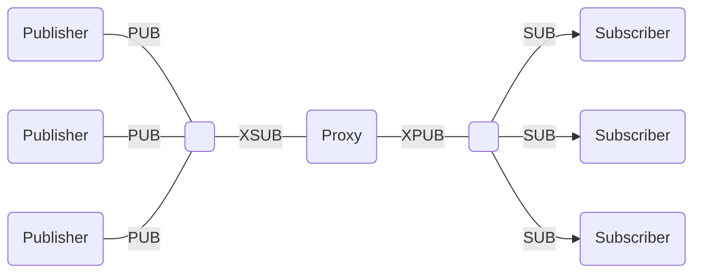
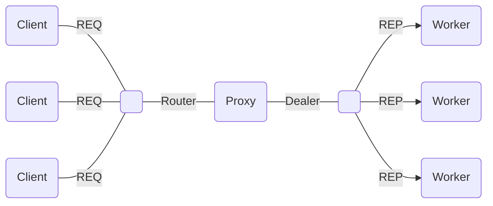

# Proxy (Intermediation)

The basic messaging patterns in ZeroMQ use direct connections between socket endpoints. The role of proxies, or *intermediaries*, is to abstract away direct references between endpoints, replacing them by references to the proxy.

The proxy itself is specified by exposing a <xref href="Bonsai.ZeroMQ.ProxyFrontend"/> socket and a <xref href="Bonsai.ZeroMQ.ProxyBackend"/> socket. All primary messages are routed from front-end to back-end, but secondary responses or subscription messages can also flow from back-end to front-end as required by the specified socket types.

This enables easily building variants of the basic patterns where peers are discovered dynamically or pools of clients and services can join and leave at any time, with the only constraint that all message passing is stateless. The examples below illustrate some of the most common proxy patterns.

### **Example:** Extended Publish-Subscribe

In the basic @pub-sub pattern, a set of subscribers connect to a single publisher. Typically the publisher binds to its endpoint and does not know the identity of the subscribers. However, all subscribers have to know the identity of the publisher endpoint. This makes it hard to replace the publisher, or to allow for multiple publishers to push data to subscribers.

The extended publish-subscribe pattern allows for dynamic discovery of both publishers and subscribers by introducing a proxy. This way, publishers do not need to know the identity of subscribers, and subscribers do not need to know the identity of publishers. Only the identity of the proxy endpoints is required.

The proxy needs to be configured with a <xref href="Bonsai.ZeroMQ.SocketType.XSubscriber"/> as the front-end socket, and a <xref href="Bonsai.ZeroMQ.SocketType.XPublisher"/> as the back-end socket. In the example below, two timers publish periodic updates to an unknown set of subscribers using this proxy pattern.

:::workflow

:::

### **Example:** Extended Request-Response

In the basic @req-rep pattern, one client connects to a single server. We can also use @router-dealer patterns so that multiple asynchronous requests can be handled in parallel by the server. However, in both cases we assume there is a single endpoint for handling service requests which is known by all clients.

The extended request-response pattern allows for clusters of workers to dynamically join or leave a shared message queue, and handle requests from existing clients as they arrive. The client connects to the proxy front-end, and workers to the proxy back-end. This way we can scale up the number of workers without having to change anything about the clients.

The shared queue is simply a proxy configured with a <xref href="Bonsai.ZeroMQ.SocketType.Router"/> as the front-end socket, and a <xref href="Bonsai.ZeroMQ.SocketType.Dealer"/> as the back-end socket. In the example below, a timer sends periodic requests to the shared queue, and workers alternate servicing the requests.

Each reply is tagged with the identity of the worker who handled the request for easy visualization.

:::workflow

:::