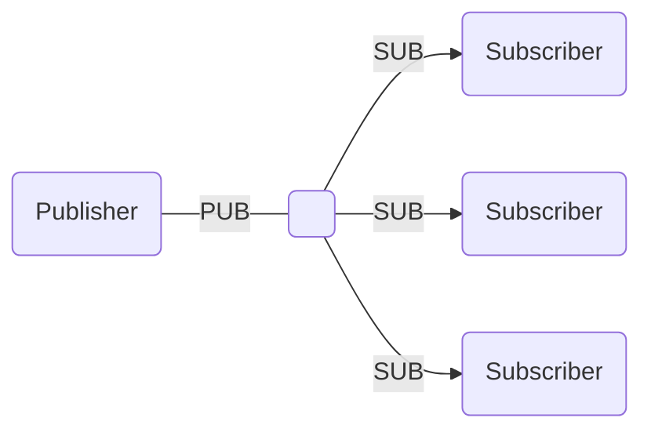

# Publish-Subscribe

The publish-subscribe (pub-sub) pattern implements one-way data distribution, in which a <xref href="Bonsai.ZeroMQ.Publisher"/> node pushes a stream of updates to a set of <xref href="Bonsai.ZeroMQ.Subscriber"/> nodes. Messages pushed by the publisher are sent to all subscribers active at the moment of sending the message.

Distribution is fully asynchronous, and publisher and subscriber nodes can be started in any order. Publisher nodes may specify a <xref href="Bonsai.ZeroMQ.Publisher.Topic"/> for each sent message. When connecting to a publisher, subscriber nodes can subscribe to one or more topics. If no topic is specified, subscriber nodes will receive all messages from the publisher.

> [!Warning]
> Subscriber nodes are not guaranteed to receive the same number of messages sent by the publisher or by other subscribers. Initializing a connection to the publisher can take long enough that messages already being sent are lost, so it is best to assume that pub-sub streams are infinite streams with no beginning or end.

### **Example:** Simple publish-subscribe stream

In the example below, a periodic timer publishes counter updates with multiple downstream subscribers. The numeric data is packed into an array of bytes for transmission, and parsed back on reception.

:::workflow

:::