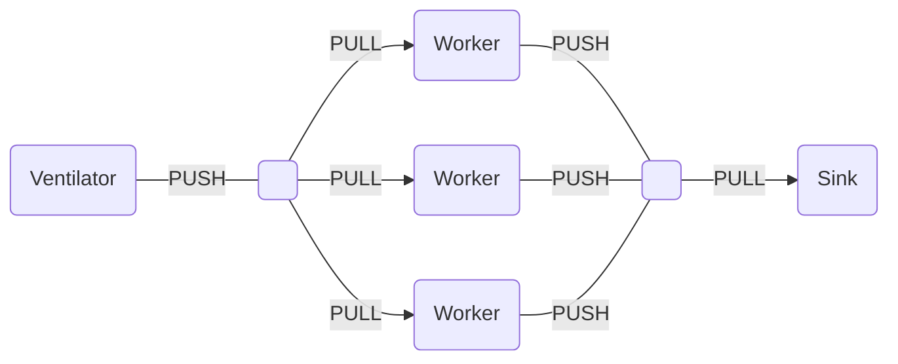

# Push-Pull (Pipeline)

The pipeline (push-pull) pattern is intended for task distribution in a fan-out (one-to-many) or fan-in (many-to-one) pattern. The <xref href="Bonsai.ZeroMQ.Push"/> operator is used to distribute messages to a set of anonymous peers using a round-robin algorithm. Peers use a <xref href="Bonsai.ZeroMQ.Pull"/> source to receive tasks using a fair-queue algorithm.

The most common application of the pipeline pattern is to implement divide-and-conquer strategies, where a node (**Ventilator**) divides a large computation into smaller sub-tasks which are distributed to a pool of **Workers**. All results are then pushed to be aggregated by a collector (**Sink**).

Messages are not discarded even if no worker nodes are available to process tasks, and new nodes can join the pattern at any time.

> [!Warning]
> Messages may be lost if a worker node crashes in the middle of processing its chunk, or during transmission of a task. Feedback strategies at the level of the collector may be used to mitigate for such failures if necessary.

### **Example:** Fan-out task distribution

In the example below, a periodic timer distributes unique identifiers to anonymous worker peers. Notice that each identifier is pulled by one and only one worker, using a round-robin strategy.

:::workflow

:::