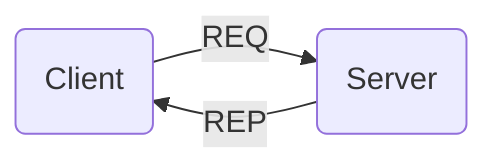

# Request-Response

The request-response (req-rep) pattern is used to connect a set of clients to a set of services. It can also be seen as a form of remote procedure call and a simple task distribution pattern.

On the client side, messages containing the details of each call are pushed by each client using a <xref href="Bonsai.ZeroMQ.Request"/> node. On the server side, a <xref href="Bonsai.ZeroMQ.Response"/> source is used to receive notifications of new requests. This pattern is strictly sequential: a new request is received by the server only after a response to the previous request has been sent back to the client.

### **Example:** Simple request-response

In the example below, a periodic timer sends counter updates as a request to the server. The server replies by formatting the input string with the prefix `reply`.

:::workflow

:::