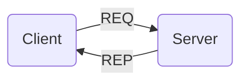

# Request-Response

The request-response (req-rep) pattern is used to connect a set of clients to a set of services. It can also be seen as a form of remote procedure call and a simple task distribution pattern.

On the client side, messages containing the details of each procedure call are pushed by each client using a <xref href="Bonsai.ZeroMQ.Request"/> node. On the server side, a <xref href="Bonsai.ZeroMQ.Response"/> node is used to receive notifications of new requests. Responses can be evaluated using the <xref href="Bonsai.ZeroMQ.SendResponse"/> operator.

> [!Warning]
> This pattern is strictly sequential: if multiple requests are sent to a <xref href="Bonsai.ZeroMQ.Response"/> socket, they will be handled by the server one at a time, in order of arrival. For asynchronous processing of requests, see the @router-dealer pattern.

### **Example:** Simple request-response

In the example below, a periodic timer sends counter updates as a request to the server. The server replies by formatting the input string with the prefix `reply`.

:::workflow

:::