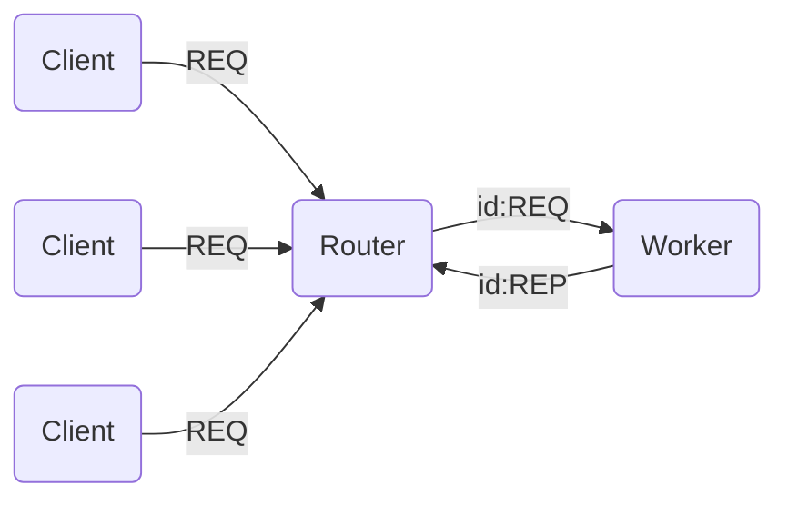

# Router-Dealer

In the @req-rep pattern we typically have one client sending requests to a single server. However, in practice we often need to allow multiple requests to be processed in parallel by the server. We can use a <xref href="Bonsai.ZeroMQ.Router"/> socket to achieve this.

On the client side, requests are sent using a <xref href="Bonsai.ZeroMQ.Request"/> node as normal, but now with multiple clients sending requests. On the server side, a <xref href="Bonsai.ZeroMQ.Router"/> node is used to dispatch notifications of new requests to workers. Responses can be evaluated asynchronously using the <xref href="Bonsai.ZeroMQ.SendResponse"/> operator.

> [!Warning]
> Requests dispatched by the router are prefixed with one or more identity frames that uniquely specify the client to which the response must be sent. Responses must preserve these frames to ensure that messages can be routed back to the client.

### **Example:** Asynchronous request-response

In the example below, multiple clients send periodic requests to an asynchronous server. The server replies by formatting the input string with the prefix `reply`.

:::workflow

:::

The <xref href="Bonsai.ZeroMQ.GetIdentity"/> operator can be used to extract all identity frames from a multiple part request. Content frames are stored after the empty delimiter frame. For simple requests this is usually the last frame, which can be retrieved directly using the `Last` property.

After processing the response, we can simply merge the identity frames with the response frame to generate an outgoing message ready to be routed.

:::workflow

:::